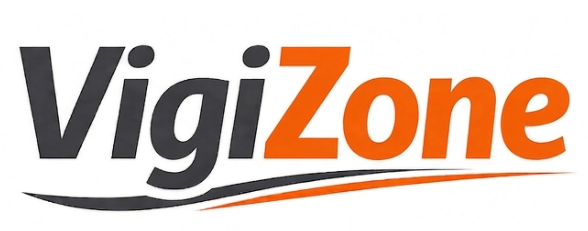
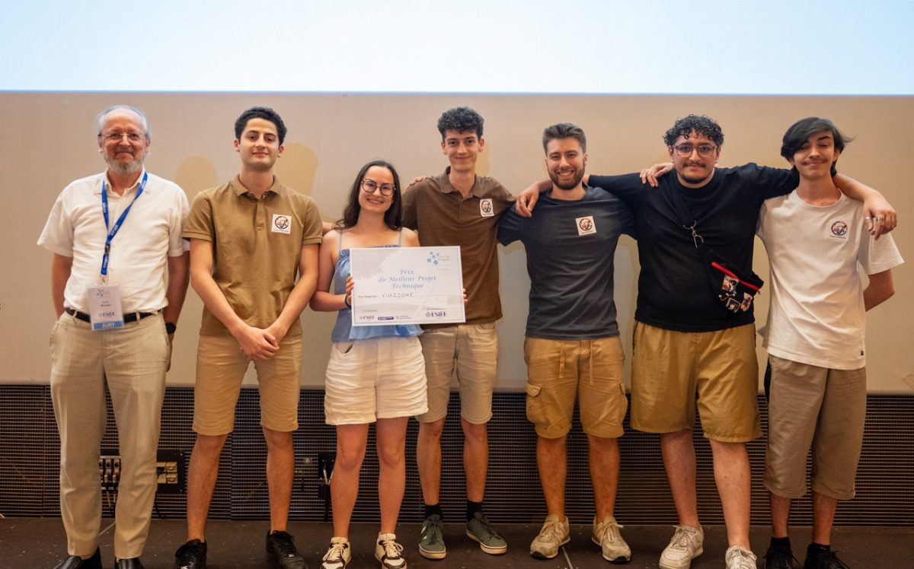
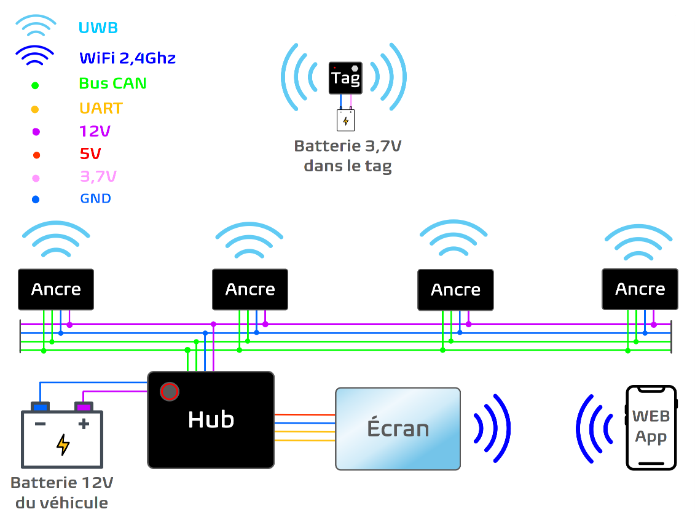
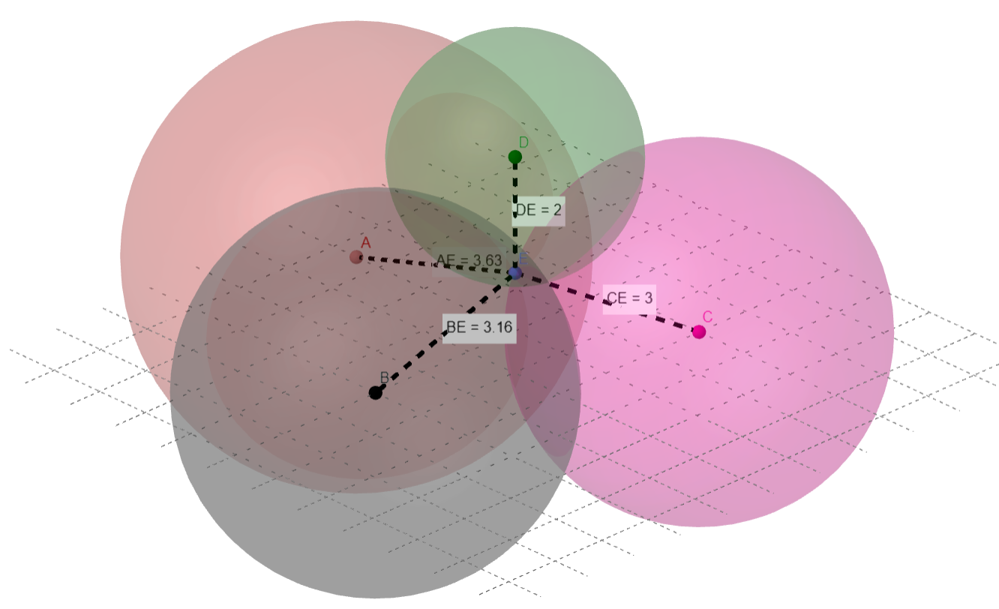
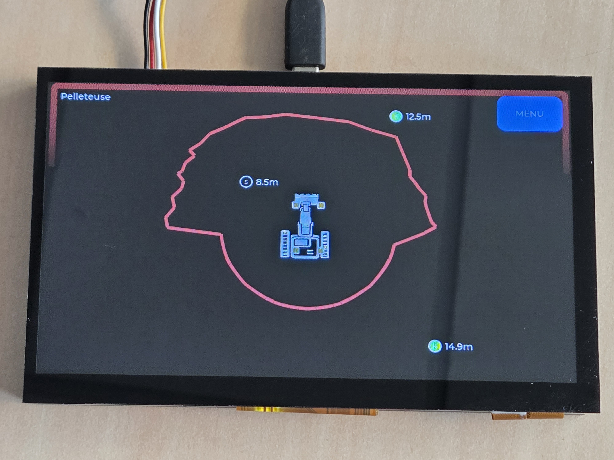

# VigiZone : Prévention des collisions engins-piétons sur chantiers

**Prix du meilleur projet technique** lors de la Journée des Projets E3 2026 à l'ESIEE Paris ! 

[Découvrir le Jour des Projets (JdP)](https://jdp.esiee.fr)

### Membres de l'équipe

*Dans l'ordre de droite à gauche :*
* Hugues JOUHAUD
* Naïm BEN-RAÏES
* Benoît DE KEYN
* Maxime LE BLAN
* Clarisse BLONDEL
* Jérémy FOUILLOUX

Réalisé en mai-juin 2026 à ESIEE Paris. Prix décerné par M. Denis BUREAU (tout à gauche), professeur d'informatique à ESIEE Paris.

**[Lire le rapport complet du projet VigiZone (PDF)](https://drive.google.com/uc?export=download&id=16rXCA4nlOrGEzkfiPZYJjSept83bqB7f)**

---

## Contexte : Un enjeu de sécurité vital

Le secteur du Bâtiment et des Travaux Publics (BTP) fait face à des risques majeurs concernant la sécurité de ses travailleurs.
* Les collisions entre les engins de chantier et les ouvriers piétons représentent la première cause d'accidents mortels dans ce domaine.
* Selon l'Organisme Professionnel de Prévention du Bâtiment et des Travaux Publics (OPPBTP), on dénombre environ quinze décès par an causés par ces collisions.

Initialement, notre équipe souhaitait développer un dispositif pour les travailleurs isolés. Cependant, des échanges avec Monsieur Luc-Géry Helle, directeur régional génie civil de GTM Ouest (VINCI Construction France), ont mis en lumière une contrainte réglementaire stricte : la législation française interdit ou encadre très fortement le travail isolé sur les chantiers de construction. Le projet a donc été réorienté pour répondre au besoin critique de la prévention des collisions.

---

## Qu'est-ce que VigiZone ?

VigiZone est un système embarqué de détection en temps réel conçu pour éviter les collisions entre les ouvriers et les véhicules de chantier. 

Face à ce danger, les systèmes d'alarme sonores classiques (comme les bips de recul) perdent en efficacité, car les ouvriers s'habituent au bruit ambiant. De leur côté, les solutions basées sur des caméras IA ou des capteurs LiDAR sont extrêmement coûteuses et voient leurs performances chuter dans des conditions difficiles (poussière, boue, faible luminosité). 

C'est pourquoi VigiZone s'appuie sur la technologie **Ultra Wide Band (UWB)** :
* L'UWB offre une très haute précision de positionnement en se basant sur le temps de vol du signal.
* C'est un signal robuste capable de bien traverser les obstacles.

---

## Architecture et Utilisation

Le fonctionnement de VigiZone repose sur la communication entre trois sous-systèmes interdépendants :

* **Le Hub central (Unité de bord) :** Placé dans la cabine du conducteur et alimenté par la batterie de l'engin, il fusionne les données pour calculer les distances par trilatération. 
  
  
  
  Il est équipé d'un écran permettant de localiser les ouvriers en direct par rapport à une zone de danger et d'une alarme sonore.

  

* **Les Ancres (Boîtiers véhicule) :** Quatre capteurs disposés sur l'armature de l'engin (par exemple, aimantés) qui servent à localiser les ouvriers.
* **Le Tag (Boîtier ouvrier) :** Un équipement de protection individuelle (EPI) compact porté par l'ouvrier (sur son casque ou à la ceinture). Afin de garantir la sécurité, il ne possède aucun bouton d'arrêt et s'allume automatiquement.

**Scénario d'utilisation :** Si un ouvrier équipé d'un Tag pénètre dans une zone de danger virtuelle délimitée autour de l'engin, le système alerte instantanément les deux parties. Le conducteur est averti par l'écran et une alarme en cabine, tandis que le Tag de l'ouvrier déclenche une alerte sonore suffisamment puissante pour couvrir le bruit du chantier.

---

## Limites et Nuances du Système

Bien que la technologie UWB apporte une grande fiabilité de détection, notre solution technique ne prétend pas résoudre entièrement le problème des accidents. 

Comme nous l'a expliqué Monsieur Mathieu Baré, directeur prévention délégation génie civil Ouest chez VINCI Construction France, lors de notre visite sur le chantier du Grand Paris Express : plusieurs dispositifs de prévention existent, mais chacun possède ses avantages et ses limites selon les situations. À ce jour, aucun système ne permet de supprimer complètement le risque de collision entre engins et piétons. VigiZone doit donc être perçu comme un outil d'assistance et une couche de sécurité supplémentaire, qui vient compléter, mais en aucun cas remplacer, la vigilance indispensable des conducteurs et des ouvriers.

---

## En savoir plus

Pour consulter l'intégralité de notre démarche (choix technologiques, algorithmes de trilatération, conception des cartes sous KiCad et analyse éthique), nous vous invitons à lire notre rapport complet.

**[Lire le rapport complet du projet VigiZone (PDF)](https://drive.google.com/uc?export=download&id=16rXCA4nlOrGEzkfiPZYJjSept83bqB7f)**
